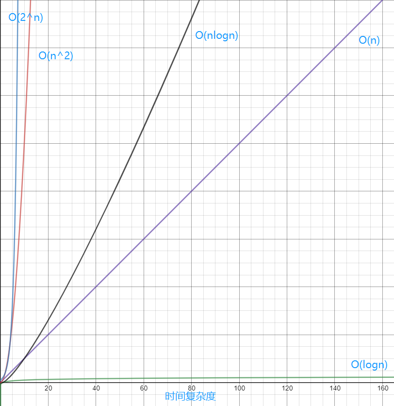

# LeetCode

LeetCode 算法练习

## 时间复杂度

## easy

- [No.1 Two Sum](./easy/_001/_001.md)
- [No.2 Add Two Numbers](./easy/_002/_002.md)
- [No.3 Longest Substring Without Repeating Characters](./easy/_003/_003.md)
- [No.4 Median of Two Sorted Arrays](./easy/_004/_004.md)
- [No.7 Reverse Integer](./easy/_007/_007.md)
- [No.9 Palindrome Number](./easy/_009/_009.md)
- [No.13 Roman to Integer](./easy/_013/_013.md)
- [No.14 Longest Common Prefix](./easy/_014/_014.md)
- [No.20 Valid Parentheses](./easy/_020/_020.md)
- [No.21 Merge Two Sorted Lists](./easy/_021/_021.md)
- [No.26 Remove Duplicates From Sorted Array](./easy/_026/_026.md)
- [No.27 Remove Element](./easy/_027/_027.md)
- [No.28 Implement strStr()](./easy/_028/028.md)
- [No.35 Search Insert Position](./easy/_035/035.md)
- [No.38 Count and Say](./easy/_038/038.md)
- [No.53 Maximum Subarray](./easy/_053/053.md)
- [No.58 Length of Last Word](./easy/_058/_058.md)
- [No.66 Plus One](./easy/_066/_066.md)
- [No.67 Add Binary](./easy/_067/_067.md)
- [No.69 sqrt(x)](./easy/_067/_067.md)
- [No.70 Climbing Stairs](./easy/_070/_070.md)
- [No.83 Remove Duplicates from Sorted List](./easy/_083/083.js)
- [No.88 Merge Sorted Array](./easy/_088/_088.md)
- [No.100 Same Tree](./easy/_100/_100.js)
- [No.101 Symmetric Tree](./easy/_101/_101.md)
- [No.104 二叉树的最大深度](./easy/_104/_104.md)
- [No.104 二叉树的层次遍历 II](./easy/_107/_107.js)
- [No.108 将有序数组转换为二叉搜索树](./easy/_108/_108.js)
- [No.110 判断一个树是否是平衡二叉树](./easy/_110/_110.js)
- [No.111 二叉树的最小深度](./easy/_111/_111.md)
- [No.112 路径总和](./easy/_112/_112.md)
- [No.118 杨辉三角](./easy/_118/_118.js)
- [No.119 杨辉三角 II](./easy/_119/_119.md)
- [NO.121 买卖股票的最佳时机](./easy/_121/_121.md)
- [NO.122 买卖股票的最佳时机 II](./easy/_122/_122.md)
- [NO.125 验证回文串](./easy/_125/_125.js)
- [No.136 String Number](./easy/_136/_136.js)
- [No.141 环形链表](./easy/_141/_141.js)
- [No.155 最小栈](./easy/_155/_155.js)
- [No.160 相交链表](./easy/_160/_160.js)
- [No.167 两数之和 II - 输入有序数组](./easy/_167/_167.js)
- [No.168 Excel表列名称](./easy/_168/_168.js)
- [No.169 求众数](./easy/_169/_169.js)
- [No.171 Excel表列序号](./easy/_171/_171.js)
- [No.172 阶乘后的零](./easy/_172/_172.js)
- [No.175 组合两个表](./easy/_175/_175.sql)
- [No.176 第二高的薪水](./easy/_176/_176.sql)
- [No.181 超过经理收入的员工](./easy/_181/_181.sql)
- [No.182 查找重复的电子邮箱](./easy/_182/_182.sql)
- [No.183 从不订购的客户](./easy/_183/_183.sql)
- [No.189 旋转数组](./easy/_189/_189.js)
- [No.190 颠倒二进制位](./easy/_190/_190.js)
- [No.191 位1的个数](./easy/_191/_191.js)
- [No.196 删除重复的电子邮箱](./easy/_196/_196.sql)
- [No.197 上升的温度](./easy/_197/_197.sql)
- [No.198 打家劫舍](./easy/_198/_198.js)
- [No.202 快乐数](./easy/_202/_202.js)
- [No.203 移除链表元素](./easy/_203/_203.js)
- [No.204 计算质数](./easy/_204/_204.js)
- [No.205 同构字符串](./easy/_205/_205.js)
- [No.206 反转链表](./easy/_206/_206.js)
- [No.217 存在重复元素](./easy/_217/_217.js)
- [No.219 存在重复元素 II](./easy/_219/_219.js)
- [No.225 用队列实现栈](./easy/_225/_225.js)
- [No.226 翻转二叉树](./easy/_226/_226.js)
- [No.231 2的幂](./easy1/_231/_231.js)
- [No.232 用栈实现队列](./easy1/_232/_232.js)
- [No.234 回文链表](./easy1/_234/_234.js)
- [No.235 二叉搜索树的最近公共祖先](./easy1/_235/_235.js)
- [No.237 Delete Node in a Linked List](./easy/_237/_237.js)
- [No.242 有效的字母异位词](./easy1/_242/_242.js)
- [No.257 二叉树的所有路径](./easy1/_257/_257.js)
- [No.258 添加数字](./easy1/_258/_258.js)
- [No.263 丑数](./easy1/_263/_263.js)
- [No.268 丢失的数字](./easy1/_268/_268.js)
- [No.278 第一个错误的版本](./easy1/_278/_278.js)
- [No.283 移动零](./easy1/_283/_283.js)
- [No.290 单词规律](./easy1/_290/_290.js)
- [No.292 Nim Game](./easy/_292/_292.js)
- [No.303 区域和检索 - 数组不可变](./easy1/_303/_303.js)
- [No.326 3的幂](./easy1/_326/_326.js)
- [No.342 4的幂](./easy1/_342/_342.js)
- [No.345 反转字符串中的元音字母](./easy1/_345/_345.js)
- [No.344 Reverse String](./easy/_344/_344.js)
- [No.349 两个数组的交集](./easy1/_349/_349.js)
- [No.350 两个数组的交集 II](./easy1/_350/_350.js)
- [No.367 有效的完全平方数](./easy1/_367/_367.js)
- [No.371 两整数之和](./easy1/_371/_371.js)
- [No.374 猜数字大小](./easy1/_374/_374.java)
- [No.383 赎金信](./easy1/_383/_383.js)
- [No.387 字符串中的第一个唯一字符 赎金信](./easy1/_387/_387.js)
- [No.389 找不同](./easy1/_389/_389.js)
- [No.392 判断子序列](./easy1/_392/_392.js)
- [No.401 二进制手表](./easy1/_401/_401.js)
- [No.404 左叶子之和](./easy1/_404/_404.js)
- [No.405 数字转换为十六进制数](./easy1/_405/_405.js)
- [No.409 最长回文串](./easy1/_409/_409.js)
- [No.412 Fizz Buzz](./easy1/_412/_412.js)
- [No.414 第三大的数](./easy1/_414/_414.js)
- [No.415 字符串相加](./easy1/_415/_415.js)
- [No.434 字符串中的单词数](./easy1/_434/_434.js)
- [No.437 路径总和 III](./easy1/_437/_437.js)
- [No.441 排列硬币](./easy1/_441/_441.js)
- [No.443 压缩字符串](./easy1/_443/_443.js)
- [No.447 回旋镖的数量](./easy1/_447/_447.js)
- [No.448 找到所有数组中消失的数字](./easy1/_448/_448.js)
- [No.453 最小移动次数使数组元素相等](./easy1/_453/_453.js)
- [No.459 重复的子字符串](./easy1/_459/_459.js)
- [No.448 Find All Numbers Disappeared in an Array](./easy/_448/_448.js)
- [No.461 汉明距离](./easy1/_461/_461.js)
- [No.463 岛屿的周长](./easy1/_463/_463.js)
- [No.475 供暖器](./easy1/_475/_475.js)
- [No.476 数字的补数](./easy1/_476/_476.js)
- [No.482 密钥格式化](./easy1/_482/_482.js)
- [No.485 最大连续1的个数](./easy1/_485/_485.js)
- [No.492 构造矩形](./easy1/_492/_492.js)
- [No.496 下一个更大元素 I](./easy1/_496/_496.js)
- [No.500 键盘行](./easy1/_500/_500.js)
- [No.501 二叉搜索树中的众数](./easy1/_501/_501.js)
- [No.504 七进制数](./easy1/_504/_504.js)
- [No.506 相对名次](./easy1/_506/_506.js)
- [No.507 完美数](./easy1/_507/_507.js)
- [No.520 Detect Capital](./easy/_520/_520.js)
- [No.557 Reverse Words in a String](./easy/_557/_557.js)
- [No.617 Merge Two Binary Trees](./easy/_617/_617.js)
- [No.657 Judge Route Circle](./easy/_657/_657.js)
- [No.709 To Lower Case](./easy/_709/_709.js)
- [No.771 Jewels and Stones](./easy/_771/_771.md)
- [No.804 Unique Morse Code Words](./easy/_804/_804.md)
- [No.977 Squares of a Sorted Array](./easy/_977/_977.md)
